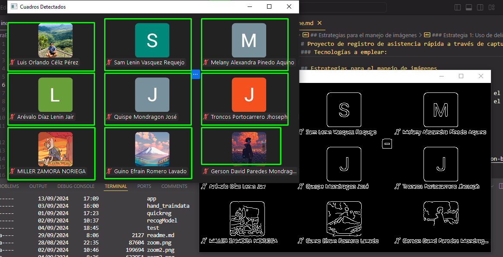
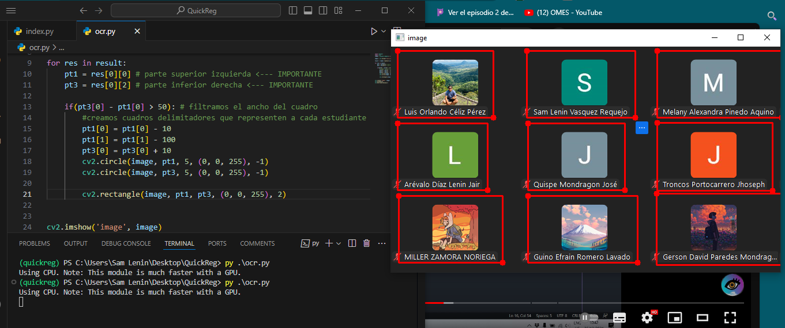
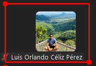
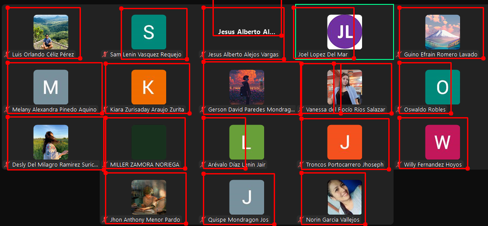
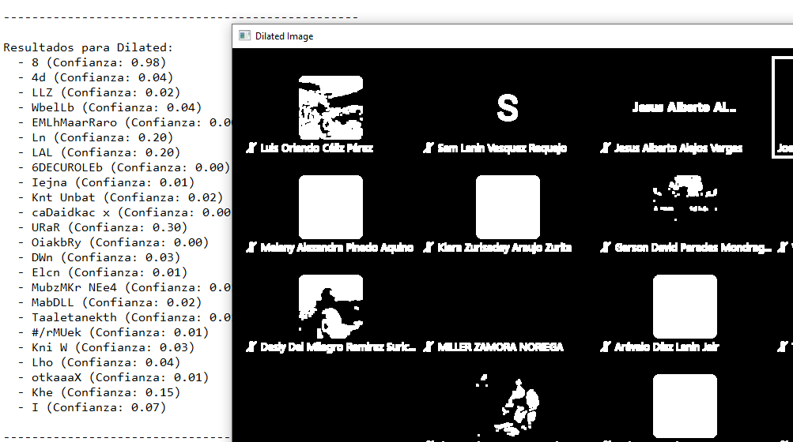
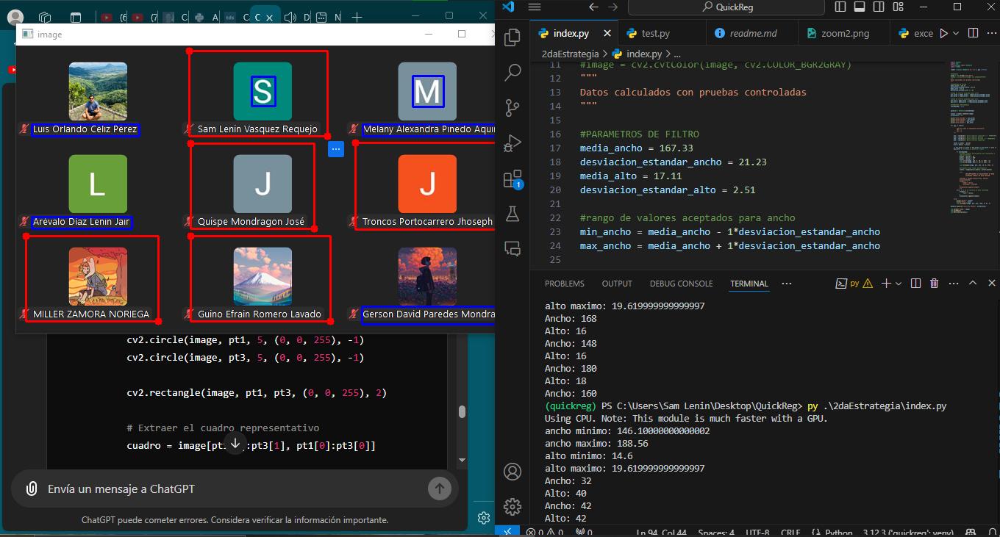
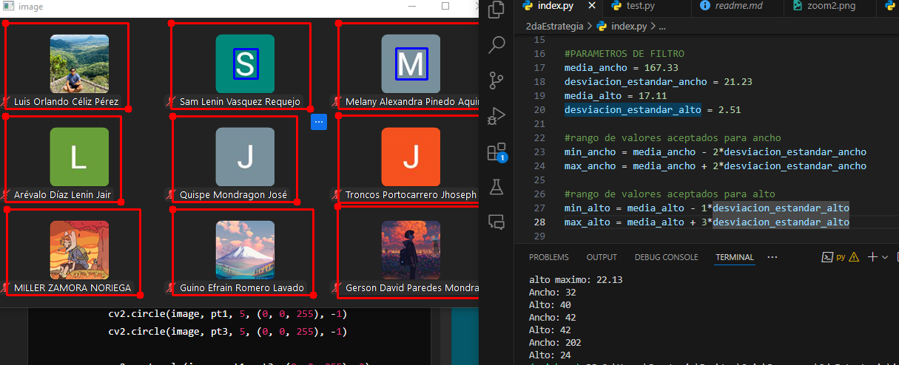

# Proyecto de Registro de Asistencia Rápida a través de Captura (Documentación en desarrollo)

Este proyecto, solicitado por la clase de Simulación y Modelado, tiene como objetivo facilitar el registro de asistencia para el docente mediante capturas de pantalla. Aunque no es la solución más recomendada para cursos virtuales, en los que la asistencia real de los estudiantes podría cuestionarse, esta metodología agiliza significativamente el proceso de registro, especialmente si se adoptan medidas complementarias, como encender la cámara o utilizar reacciones (emoji). Estas últimas no serán cubiertas en este proyecto.

## Tecnologías empleadas:
- **Python** será el lenguaje de desarrollo principal.
- Utilizaremos la librería **EasyOCR** por su facilidad de uso y su amplio soporte para diferentes lenguajes.
- La librería **OpenCV** se usará para la manipulación de imágenes.

## Comandos que podrían serte útiles

### Crear ejecutable con PyInstaller:
```bash
pyinstaller --onedir --icon=icono.ico --add-data "templates;templates" --add-data "registros;registros" app.py
```

### Eliminar todos los módulos instalados en el entorno de desarrollo (Windows):
Es importante ejecutar este comando en CMD:
```bash
for /F "delims==" %i in ('pip freeze') do pip uninstall -y %i
``` 

## Estrategias para el manejo de imágenes

### Estrategia 1: Uso de delimitadores por filtros (carpeta eliminada)
Inicialmente, se planteaba el uso de algoritmos que facilitaran el reconocimiento de patrones, como el desenfoque gaussiano o el algoritmo de Canny. Un tutorial muy útil para la aplicación del algoritmo de Canny es el siguiente:

[Aplicación del algoritmo de Canny - Tutorial](https://towardsdatascience.com/canny-edge-detection-step-by-step-in-python-computer-vision-b49c3a2d8123)

Este proceso permitía detectar bordes utilizando la función `findContours` de `cv2`, obteniendo cuadrículas representativas de cada estudiante.



> **Aviso**: Esta primera estrategia fue descartada. En su lugar, se utilizó la librería EasyOCR para la delimitación de cuadrículas, aunque también presentó algunas complicaciones que se explicarán a continuación.

### Estrategia 2: Uso de OCR para la delimitación de contenedores de estudiantes
EasyOCR proporciona las coordenadas de texto en componentes de 4 puntos. Con un criterio básico de longitudes, estas coordenadas pueden ser utilizadas para crear delimitadores que representen a cada estudiante.



En un inicio, se utilizó una lógica primitiva que se basaba en longitudes promedio para detectar nombres. El criterio era que si el texto detectado superaba los 50 píxeles, se consideraba en el registro. Este enfoque era bastante básico, pero más adelante veremos cómo se mejoró.



Lo importante es que ahora podíamos obtener, de manera independiente, una cuadrícula que representara a cada estudiante. Las aplicaciones potenciales de esta característica son varias, desde el reconocimiento de patrones, como la mano levantada o la cámara encendida, hasta el refinamiento en la detección de texto.

Sin embargo, este enfoque también presentó algunos problemas:



EasyOCR detectaba artefactos que no eran relevantes para la aplicación. Pretender establecer valores fijos para el criterio de aceptación no funcionaba bien, ya que los nombres no tienen longitudes uniformes.

Para mejorar el reconocimiento de caracteres, se probaron varias estrategias, como filtros de escalado a grises, umbralización adaptativa ('Adaptive Threshold'), dilatación, y ajustes de brillo y contraste.

### Algoritmos probados:
- **Thresholded** (umbralización para segmentación de imágenes).
- **Ajustes de brillo y contraste**.
- **ADAPTIVE_THRESH_GAUSSIAN** (umbralización adaptativa).
- **Umbralización inversa**.
- **Escalado a grises**.

Sin embargo, fue sencillo descartar algunos de estos métodos:



### Conclusión:
Después de varias pruebas, se determinó que los mejores resultados se obtuvieron aplicando ajustes simples como el brillo y el contraste o el escalado a grises. No obstante, los resultados más precisos se lograron **sin aplicar ningún filtro**. Esto puede deberse a que EasyOCR ya incorpora internamente algunos algoritmos para facilitar la detección de caracteres. Por el momento, no se aplicará ningún filtro, aunque el código para implementarlos está disponible.

Otra estrategia empleada para descartar artefactos y mejorar el criterio de selección de caracteres fue el ajuste de las longitudes promedio de los nombres. Se tomó como referencia una captura con poca presencia de artefactos, y a partir de ella se calcularon el promedio y la desviación estándar de las longitudes.

```python
# Datos de las muestras proporcionadas
ancho_valores = [146, 168, 196, 136, 148, 180, 160, 170, 202]
alto_valores = [16, 16, 16, 16, 16, 18, 16, 16, 24]
```



Con esta información, se ajustó la tolerancia para la aceptación de las detecciones realizadas por EasyOCR. Tras algunos ajustes, se alcanzó un nivel de detección aceptable.

