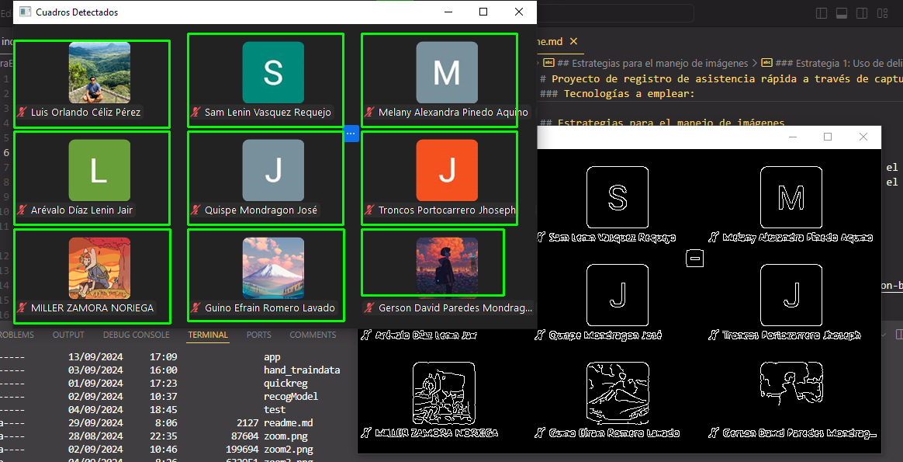

# Proyecto de registro de asistencia rápida a través de captura (Documentación en desarrollo)

El siguiente proyecto encargado por la clase de simulación y modelado tiene como propósito facilitar el registro de asistencia al docente a través de la captura de pantalla.
Si bien esto no es recomendable para cursos virtuales en los que la aparente asistencia de los estudiantes puede ser puesto en duda, sí es verdad que agiliza en gran medida el proceso de registro especialmente si adoptan medidas complementarias como prender la cámara o tener activada alguna reacción como un emoji (Cosas que por ahora no serán cubiertas en el proyecto).

### Tecnologías a emplear:
Utilizaremos Python como lenguaje de desarrollo principal
Haremos uso de la librería EasyOCR por su facilidad de uso y el amplio soporte a diferentes lenguajes que posee
También haremos uso de la librería OPENCV para la manipulación de imágenes

## Estrategias para el manejo de imágenes

### Estrategia 1: Uso de delimitadores por filtros
En un inicio se planteaba usar algoritmos que facilitaran el reconocimiento de patrones como el desenfoque gaussiano o el algoritmo de canny.

De hecho, hay un tutorial muy bueno paso a paso sobre la aplicación del algoritmo de canny:

https://towardsdatascience.com/canny-edge-detection-step-by-step-in-python-computer-vision-b49c3a2d8123

A partir de ahí se detectan bordes con la función findContours de cv2 y se obtienen cuadrículas representativas de cada estudiante.

>**Aviso**: Esta primera esta estrategia fue descartada y en su lugar se aprovechó a la librería easyOCR para la delimitación de cuadrículas. Como se verá más adelante, este también vino con sus complicaciones

### Estrategia 2 : Uso del OCR para la delimitación de contenedores de estudiantes
Esta estrategia consiste en el uso de la librería EasyOCR para ubicar todos aquellos textos que cumplan con las características buscadas (por ahora prácticamente que el ancho sea el propio de un nombre, pero más adelante se planea refinar este filtrado). 
EasyOCR proporciona las coordenadas en componentes de 4 puntos. Esto junto a un criterio básico de longitudes puede ser utilizado para crear delimitadores que representen a cada estudiante.